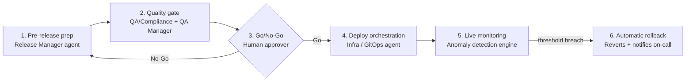

# Intent: AI-Assisted Release Deployment Workflow

Sep 28, 2026 · @Vinu Palackal

## Summary

We intend to add an AI-assisted orchestration layer on top of the existing CI/CD pipeline, covering the release path from code freeze to post-production monitoring. Specialized agents act as quality gates at four stages; a human keeps the final Go/No-Go decision.

This document states the intent only. It is the input for the next step: an OpenSpec change proposal with capability specs and requirements.

## Problem

Today's pipelines are deterministic: they run fixed scripts and static test suites and stop there. The release work around them is still manual and repetitive:

- Release notes, version bumps and breaking-change checks are assembled by hand from commits and tickets.
- Test selection ignores which code paths actually changed, so runs are either too broad (slow) or too narrow (risky).
- Pre-release checklists (tests green, docs updated, compliance items met) are verified by people cross-checking Jira and Git.
- Post-deploy regressions are caught by humans watching dashboards, and rollback often waits for an on-call engineer.

## Goals

1. Auto-generate release notes, changelogs and semantic version suggestions from commit history and tickets.
2. Flag breaking API changes before a release candidate is cut.
3. Risk-score each change and select tests based on the code paths it touches.
4. Produce a pre-release audit trail showing tests, docs and compliance items were checked.
5. Require independent multi-agent verification before any artifact reaches the production trunk.
6. Watch live signals after deploy and roll back automatically when they breach agreed thresholds.
7. Wrap new or machine-generated features in feature flags by default.

## Non-goals

- Replacing the existing CI/CD system. The agents orchestrate and gate it; builds and deploys still run through current tooling.
- Automating the final production Go/No-Go decision. That stays with a named human approver.
- Letting any single agent both propose and approve a deployment.
- Choosing specific vendors now. Tools named here (Unleash MCP server, Kuberns, Jira) are examples, not commitments.

## Architecture

Four agent stages act as quality gates around one human decision point. Agents draft, verify and monitor; the human approver alone moves a release into production.

A No-Go sends the release back to prep. After deploy, a threshold breach in the watch window triggers an automatic rollback to the previous release.

## Capabilities to spec

Each row below is intended to become one OpenSpec capability with its own requirements and scenarios.

| Capability | Owner agent | Inputs | Outputs | Key requirement (draft) |
| --- | --- | --- | --- | --- |
| `release-notes` | Release Manager | Git log, merged PRs, JIRA tickets, Confluence pages | Release notes, changelog | Every note traces to a commit, JIRA ticket or Confluence link; no invented entries |
| `version-bump` | Release Manager | Commit types, API diff | Suggested semver bump | Suggests only; a human or policy confirms |
| `breaking-change-detection` | Release Manager | API/ABI diff vs last release | Flagged breaking changes | A flagged break forces a major bump or an explicit waiver |
| `pre-release-audit` | Release Manager | Target branch or PR, Jira, CI results | Audit trail, checklist status | Missing test, doc or compliance item blocks the gate |
| `change-risk-scoring` | QA & Compliance | Diff, ownership, vulnerability scans | Risk score per change | High risk requires added review before staging |
| `adaptive-test-selection` | QA & Compliance | Changed code paths, coverage map | Test plan, results | Full suite still runs on a defined cadence as a backstop |
| `independent-verification` | QA Manager | Deployment instruction, staging env | Signed validation record | Verifier is a separate agent and identity from the proposer |
| `deploy-orchestration` | Infra / GitOps | Approved release, MCP or API connections | Deployment, feature-flag config | Deploys only with a valid signed record and human approval |
| `feature-flag-wrapping` | Infra / GitOps | New or machine-generated features | Flags off by default | Every new feature ships behind a flag |
| `post-deploy-monitoring` | Anomaly Detection | Error rates, telemetry, user behavior | Anomaly alerts | Watches a defined window (15 to 30 min proposed) |
| `auto-rollback` | Anomaly Detection | Anomaly alerts, thresholds | Rollback action, incident record | Rolls back within defined bounds and always notifies on-call |

## Guardrails and human oversight

AI drafts, checks and watches; a human decides whether production changes. Agents lack business context such as launch timing, contract deadlines and unlogged legal constraints.

| Area | Automate with AI | Keep with a human |
| --- | --- | --- |
| Release content | Draft notes, changelog, version suggestion | Final wording for customer-facing notes |
| Quality | Risk scoring, test selection, dependency checks | Waivers for flagged breaking changes or high-risk items |
| Infrastructure | Generate infrastructure-as-code drafts | Review and merge of IaC changes |
| Release decision | Aggregate evidence into a Go/No-Go summary | The Go/No-Go approval and the Deploy to Production trigger |
| Runtime | Anomaly detection, rollback within set bounds | Roll-forward, repeat deploys after a rollback, threshold changes |

### Hard rules for the spec

- No single agent can propose, verify and deploy. Proposer and verifier run as separate identities with separate credentials.
- The validation record must be cryptographically signed by the verifier and bound to the exact artifact digest. A timestamp alone is not enough, since any writer can forge one.
- Agents get least-privilege credentials; the deploy agent cannot approve its own release.
- Every agent action is logged with inputs, outputs and model version for audit.
- Content read from commits, tickets or logs is treated as data, not instructions, to resist prompt injection.
- A kill switch disables all agent-initiated actions and falls back to the manual pipeline.

## Success metrics

Targets are to be set in the spec against a measured baseline.

- Time from code freeze to release-ready package.
- Share of release notes accepted without major edits.
- Escaped defects per release versus baseline.
- Mean time to detect and to roll back a bad deploy.
- False-positive rollback rate (rollbacks later judged unnecessary).
- Zero production deploys without a valid signed verification record and human approval.

## Assumptions

- An existing CI/CD system and Git host remain the source of truth for builds.
- Jira (or equivalent) holds tickets that commits reference.
- Production exposes error-rate and telemetry signals an agent can read.
- Rollback to the previous release is technically possible for the targets in scope.

## Open questions

- [ ] Which deployment targets are in scope first: cloud services, device firmware, or both? Firmware changes rollback design (OTA, dual-bank images).
- [ ] What metrics and thresholds define an anomaly, and who owns them?
- [ ] Which rollbacks may run without a human, and which need on-call confirmation?
- [ ] Which LLM(s) and hosting model (cloud vs on-prem) are allowed, given code and data sensitivity?
- [ ] What signing infrastructure backs the verification record (e.g. Sigstore, internal PKI)?
- [ ] Which MCP servers or APIs connect agents to Git, Jira, CI, the flag service and monitoring?
- [ ] How is agent quality evaluated before it is trusted as a gate?

## Next steps

1. Resolve the open questions above with the release and platform owners.
2. Create an OpenSpec change (e.g. `add-ai-release-orchestration`) with a proposal drawn from this intent.
3. Write one spec per capability in the table, each with requirements and scenarios.
4. Plan a phased rollout: advisory mode first (agents report only), then gating, then auto-rollback.
