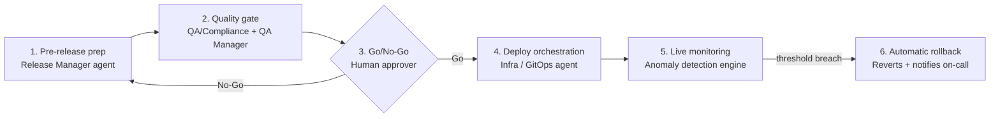

# Spec: AI-Assisted Release Orchestration

Change ID: `add-ai-release-orchestration`
Source: Intent: AI-Assisted Release Deployment Workflow (Sep 28, 2026)
Status: Draft

## Purpose

Add an AI-assisted orchestration layer on top of the existing CI/CD pipeline. Specialized agents act as quality gates from code freeze to post-deploy monitoring. A named human approver keeps the final Go/No-Go decision for production.

## Scope

- In scope: release notes, version suggestions, breaking-change detection, pre-release audit, change risk scoring, adaptive test selection, independent verification, deploy orchestration, feature-flag wrapping, post-deploy monitoring, automatic rollback.
- Out of scope: replacing the CI/CD system, automating the production Go/No-Go decision, selecting vendors.

## Actors

| Actor | Role |
| --- | --- |
| Release Manager agent | Prepares release content and the pre-release audit |
| QA & Compliance agent | Scores risk and selects and runs tests |
| QA Manager agent | Independently verifies a proposed deployment and signs the validation record |
| Infra / GitOps agent | Executes approved deployments and flag configuration |
| Anomaly Detection engine | Monitors live signals and performs rollbacks within bounds |
| Human approver | Makes the Go/No-Go decision and triggers production deploy |
| On-call engineer | Receives rollback notifications and owns follow-up |

## Flow

---

## Requirements

### Capability: release-notes

#### Requirement: Generate release notes from source history
The Release Manager agent SHALL generate draft release notes and a changelog for a release candidate from the Git log, merged PRs, linked JIRA tickets and linked Confluence pages.

#### Requirement: Every note is traceable
Every release note entry SHALL trace to at least one of: a commit SHA, a JIRA ticket ID, or a Confluence page link.

##### Scenario: Notes generated for a release branch
- **GIVEN** a release branch with merged PRs since the previous release tag
- **WHEN** the Release Manager agent is invoked with that branch
- **THEN** it produces draft release notes and a changelog grouped by change type
- **AND** every entry carries at least one trace reference: a commit SHA, a JIRA ticket ID or a Confluence link

##### Scenario: Entry traced only to Confluence
- **GIVEN** a change described in a Confluence page (e.g. a design or release-planning page) linked from the release
- **WHEN** the agent includes that change in the notes
- **THEN** the entry cites the Confluence page link as its trace
- **AND** the link resolves to an accessible page at generation time

##### Scenario: Broken or unresolvable reference
- **WHEN** a cited commit, JIRA ticket or Confluence link does not resolve
- **THEN** the entry is treated as untraced

##### Scenario: No invented entries
- **WHEN** the agent cannot trace a candidate entry to a commit, JIRA ticket or Confluence link
- **THEN** the entry is excluded from the notes and listed in an "untraced" section for human review

#### Requirement: Human sign-off on customer-facing wording
Customer-facing release notes SHALL NOT be published without human approval of the final wording.

---

### Capability: version-bump

#### Requirement: Suggest a semantic version
The Release Manager agent SHALL suggest a semantic version bump (major, minor or patch) based on commit types and the API/ABI diff.

##### Scenario: Suggestion requires confirmation
- **WHEN** the agent suggests a version
- **THEN** the version is applied only after confirmation by a human or an approved policy rule
- **AND** the suggestion records the commits that drove it

---

### Capability: breaking-change-detection

#### Requirement: Flag breaking API/ABI changes
The Release Manager agent SHALL compare the release candidate's public API/ABI against the previous release and flag breaking changes.

##### Scenario: Breaking change forces major bump or waiver
- **GIVEN** a flagged breaking change
- **WHEN** the suggested bump is minor or patch
- **THEN** the pre-release gate fails until the bump is raised to major or a human records an explicit waiver with a reason

---

### Capability: pre-release-audit

#### Requirement: Produce a pre-release audit trail
The Release Manager agent SHALL verify, for the target branch or PR, that required tests passed, documentation is updated and compliance items are complete, and SHALL record the result as an audit trail.

##### Scenario: All checks pass
- **WHEN** every required check is satisfied
- **THEN** the audit trail records each check, its evidence link and a pass status
- **AND** the release proceeds to the quality gate

##### Scenario: A check is missing
- **WHEN** any required test, doc or compliance item is missing or failing
- **THEN** the gate is blocked
- **AND** the audit trail names the missing item and its owner

---

### Capability: change-risk-scoring

#### Requirement: Risk-score each change before staging
The QA & Compliance agent SHALL assign a risk score to each change using the diff, code ownership and vulnerability scan results.

##### Scenario: High-risk change
- **WHEN** a change scores at or above the configured high-risk threshold
- **THEN** it requires additional human review before deployment to staging
- **AND** the score and its contributing factors are recorded

---

### Capability: adaptive-test-selection

#### Requirement: Select tests by changed code paths
The QA & Compliance agent SHALL select and run tests based on the code paths changed in the release candidate, using a coverage map.

##### Scenario: Targeted run
- **WHEN** a release candidate is submitted
- **THEN** the agent runs all tests mapped to changed paths plus a fixed smoke suite
- **AND** records the selected test plan and results

#### Requirement: Full-suite backstop
The full test suite SHALL still run on a defined cadence, independent of test selection.

##### Scenario: Unmapped change
- **WHEN** a changed path has no coverage mapping
- **THEN** the agent falls back to the full suite for that release candidate

---

### Capability: independent-verification

#### Requirement: Separate proposer and verifier
The QA Manager agent SHALL run as a separate agent identity with separate credentials from the agent that proposes a deployment.

#### Requirement: Signed validation record
After a simulated deployment in staging, the QA Manager agent SHALL produce a validation record that is cryptographically signed and bound to the exact artifact digest.

##### Scenario: Verification succeeds
- **WHEN** the simulated deployment and its checks pass
- **THEN** the verifier writes a validation record containing the artifact digest, check results and a timestamp
- **AND** signs it with the verifier's key

##### Scenario: Verification fails
- **WHEN** the simulated deployment or any check fails
- **THEN** no signed record is produced
- **AND** the release returns to pre-release prep with the failure details

---

### Capability: human-go-no-go

#### Requirement: Human approval for production
Deployment to production SHALL require an explicit Go decision by a named human approver.

##### Scenario: Evidence summary presented
- **WHEN** a release has a valid signed validation record
- **THEN** the system presents the approver with an aggregated summary: release notes, audit trail, risk scores, test results and verification status

##### Scenario: No-Go
- **WHEN** the approver selects No-Go
- **THEN** the release returns to pre-release prep
- **AND** the decision and reason are logged

---

### Capability: deploy-orchestration

#### Requirement: Deploy only with valid evidence and approval
The Infra / GitOps agent SHALL deploy to production only when both a valid signed validation record for the exact artifact digest and a recorded human Go decision exist.

##### Scenario: Signature invalid or digest mismatch
- **WHEN** the signature fails verification or the digest does not match the artifact to deploy
- **THEN** the deployment is refused and the approver and on-call are notified

##### Scenario: No human approval
- **WHEN** no Go decision is recorded for the release
- **THEN** the deployment is refused

#### Requirement: Use existing tooling via MCP or APIs
The agent SHALL execute deployments through the existing CI/CD and GitOps tooling, connected through MCP servers or APIs, and SHALL NOT bypass them.

---

### Capability: feature-flag-wrapping

#### Requirement: New features ship behind flags
Every new or machine-generated feature SHALL be deployed behind a feature flag that is off by default.

##### Scenario: Unflagged feature detected
- **WHEN** a release contains a new feature without a flag
- **THEN** the agent creates the flag configuration (off) or blocks the release until one exists

---

### Capability: post-deploy-monitoring

#### Requirement: Watch live signals after deploy
The Anomaly Detection engine SHALL monitor error rates, telemetry and user-behavior signals for a configurable watch window after each production deploy (default proposed: 15 to 30 minutes).

##### Scenario: Healthy window
- **WHEN** no signal breaches its threshold during the watch window
- **THEN** the release is marked complete and the monitoring summary is recorded

##### Scenario: Anomaly detected
- **WHEN** a signal breaches its configured threshold
- **THEN** an anomaly alert is raised with the signal, value, threshold and time

---

### Capability: auto-rollback

#### Requirement: Roll back within defined bounds
The Anomaly Detection engine SHALL automatically roll back to the previous release when an anomaly meets the configured rollback criteria, and only within the rollback bounds approved by humans.

##### Scenario: Automatic rollback
- **WHEN** an anomaly meets rollback criteria inside the watch window
- **THEN** the engine reverts to the previous release
- **AND** notifies on-call and opens an incident record with the triggering evidence

##### Scenario: Outside automatic bounds
- **WHEN** the rollback falls outside the approved automatic bounds
- **THEN** the engine requests on-call confirmation instead of acting

#### Requirement: No automatic roll-forward
After a rollback, redeploying the same or a fixed release SHALL require the full flow, including a new human Go decision.

---

## Cross-cutting requirements

### Requirement: Least privilege
Each agent SHALL hold only the credentials its capability needs. The deploy agent SHALL NOT be able to record approvals or sign validation records.

### Requirement: Audit logging
Every agent action SHALL be logged with inputs, outputs, agent identity, model and version, and timestamp.

### Requirement: Untrusted input handling
Content read from commits, tickets, logs and telemetry SHALL be treated as data, not instructions.

#### Scenario: Injected instruction in a commit message
- **WHEN** a commit message contains text instructing an agent to skip checks or approve a release
- **THEN** the agent ignores it and flags the commit for human review

### Requirement: Kill switch
A kill switch SHALL disable all agent-initiated actions and fall back to the manual pipeline.

#### Scenario: Kill switch activated
- **WHEN** an authorized human activates the kill switch
- **THEN** no agent starts new deploy, rollback or flag actions
- **AND** in-flight agent actions are halted where safe and reported

### Requirement: Phased enablement
Capabilities SHALL be enabled in three phases: advisory (agents report only), gating (agents can block), then automatic rollback.

---

## Success metrics

Targets to be set against a measured baseline.

- Time from code freeze to release-ready package
- Share of release notes accepted without major edits
- Escaped defects per release
- Mean time to detect and to roll back a bad deploy
- False-positive rollback rate
- Zero production deploys without a valid signed record and human approval

## Assumptions

- Existing CI/CD and Git host remain the source of truth for builds.
- Jira (or equivalent) holds tickets that commits reference.
- Production exposes error-rate and telemetry signals agents can read.
- Rollback to the previous release is technically possible for in-scope targets.

## Open questions

- [ ] Which deployment targets are in scope first: cloud services, device firmware, or both? Firmware changes rollback design (OTA, dual-bank images).
- [ ] Which metrics and thresholds define an anomaly and rollback criteria, and who owns them?
- [ ] Which rollbacks may run without a human, and which need on-call confirmation?
- [ ] Which LLM(s) and hosting model (cloud vs on-prem) are allowed?
- [ ] What signing infrastructure backs the validation record (e.g. Sigstore, internal PKI)?
- [ ] Which MCP servers or APIs connect agents to Git, Jira, CI, the flag service and monitoring?
- [ ] How is agent quality evaluated before it is trusted as a gate?
